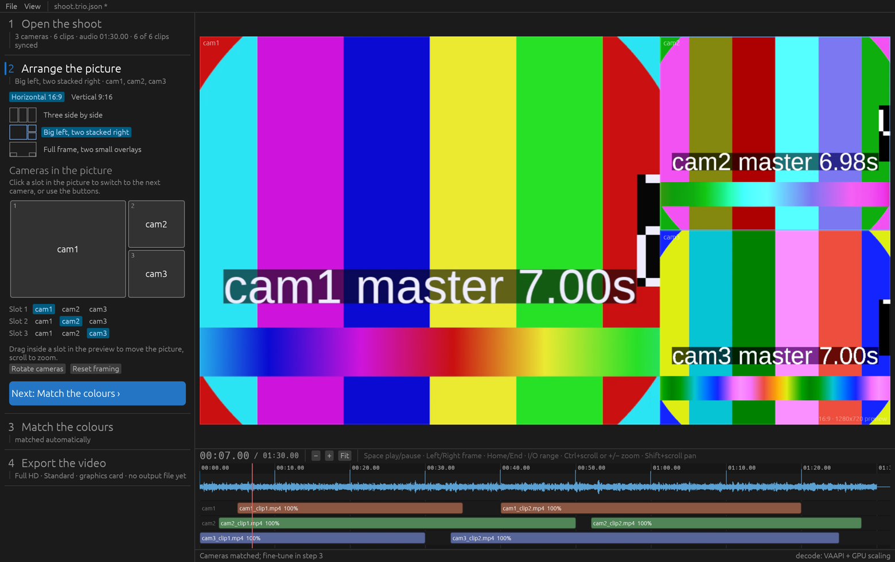
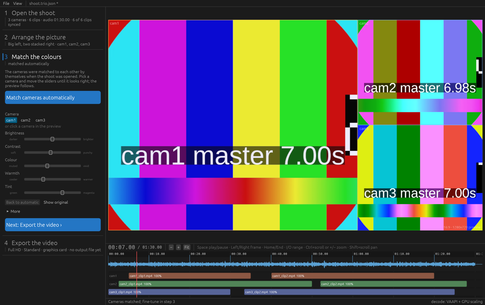
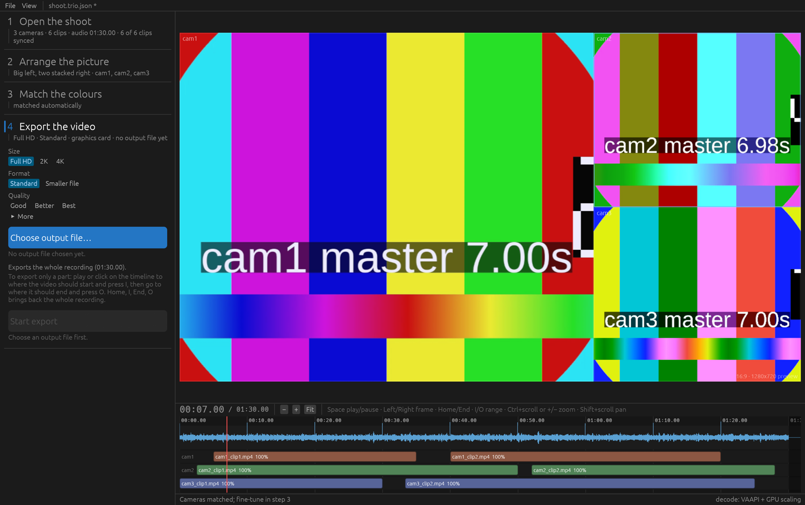
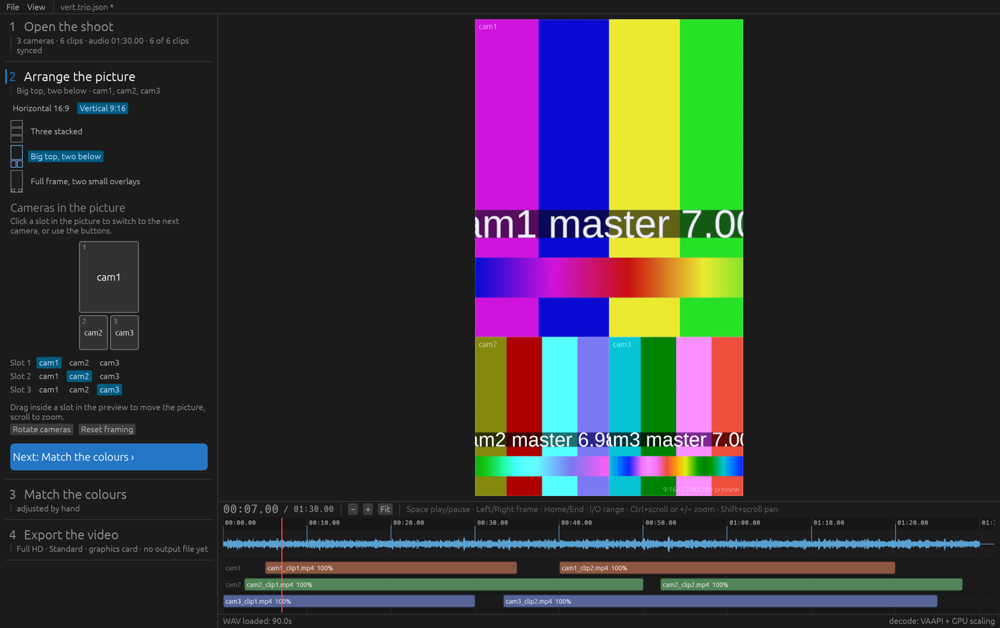

# trio-capture

A fast, non-destructive 3-camera composer for band recordings.

You give it one shoot folder. It syncs every clip to the WAV by matching
audio, lets you arrange the three perspectives in a horizontal (16:9) or
vertical (9:16) layout, zoom and pan each slot, color grade each camera while
looking at the whole composition, and exports one video with the WAV as the
soundtrack. Preview and export run the same GPU shader, so what you see is
what you get.

Runs on Linux and macOS. See [docs/PLAN.md](docs/PLAN.md) for the design.



## The shoot folder

Put everything from one shoot into one folder: a subfolder per phone camera
and the recorder's WAV next to them.

```
Band 2026-09-01/
  Cam1/   VID_0001.mp4  VID_0002.mp4 ...
  Cam2/   IMG_2054.MOV ...
  Cam3/   PXL_20260901_201710.mp4 ...
  master.wav
```

The names do not matter. Every direct subfolder that holds at least one
video file (`mp4`, `mov`, `m4v`, `mkv`, `3gp`, `webm`) is a camera, taken in
name order, so `Cam1`, `Cam2`, `Cam3` land in the right slots. With more than
three such folders, those whose name contains "cam" win and the rest are
ignored. The audio file directly in the folder is the master; among several
a `.wav` is preferred, then the largest. Hidden entries and subfolders
without video (a DAW project, say) are skipped. Each camera folder may hold
any number of clips; they are ordered by recording time.

The project file (`<folder name>.trio.json`) is saved into the shoot folder
on Ctrl+S. Opening a folder that already contains one opens that project
instead of importing again. Nothing is ever written into the camera folders.

## Requirements

- `ffmpeg` and `ffprobe` on `PATH` (Linux: `apt install ffmpeg`, macOS: `brew install ffmpeg`).
- A GPU with Vulkan (Linux) or Metal (macOS).
- Rust 1.92 or newer to build.
- Linux only: `libasound2-dev` for audio playback. If it is missing, the
  repo ships a small pkg-config shim (`tools/alsa-shim`) that links against
  the system's runtime libasound so the build still works.

Hardware decoding is detected automatically (VAAPI on Linux, VideoToolbox on
macOS) and falls back to software decoding.

## Build and run

```sh
cargo build --release
./target/release/trio-capture                       # empty project
./target/release/trio-capture "Band 2026-09-01/"    # import a shoot folder
./target/release/trio-capture band.trio.json        # open a saved project
```

## Workflow

The left side of the window lists four numbered steps. The current step is
open and has a blue mark; the others show a one-line summary and open on a
click. The big blue button in each step is the thing to do there.

1. **Open the shoot**: pick the shoot folder described above. Every video
   file in a camera folder becomes a clip, ordered by its recording time, and
   the clips are lined up with the audio by themselves. Each clip's own audio
   is cut into 15 s chunks that are matched against the WAV; the offset most
   chunks agree on wins, and the percentage shown on the timeline is the
   share of chunks that agree. Clips may start before the WAV (negative
   offset) or run past its end. The clips of one camera are then arranged so
   they never overlap; a clip whose audio matches nothing is placed from its
   recording timestamp next to a matched sibling and shown at 0 %. *Pick the
   folders by hand* holds the per-camera folder and audio file fields for
   shoots that are not in one folder. The app then moves on to the next step.
2. **Arrange the picture**: choose horizontal or vertical and a preset. The
   layout is drawn large; click a slot to move it on to the next camera, or
   use the camera buttons under it. In the preview, drag inside a slot to
   move the picture and scroll to zoom; *Reset framing* undoes that.
3. **Match the colours**: the cameras are matched to each other
   automatically after sync. Click a slot to pick its camera, then move the
   plain sliders (brightness, contrast, colour, warmth, tint) until it looks
   right; *Show original* compares with the recording, *Back to automatic*
   drops your changes, and double-clicking a slider resets just that one.
   *More* holds shadows, mid-tones and highlights. The grade follows the
   camera into every slot it occupies.
4. **Export the video**: pick a size (Full HD, 2K, 4K), a format (*Standard*
   H.264 or *Smaller file* H.265) and a quality (Good, Better, Best), choose
   the output file, go. The graphics card encoder is used
   by itself whenever one is found; *More* holds the frame rate and lets you
   force the processor or the graphics card instead. The whole recording is
   exported unless you mark a part with the I and O keys on the timeline;
   the step shows what will be exported. Export runs inside the app with a
   progress bar and can be cancelled.

The *View* menu sets the preview quality (how large the cameras are decoded
for playback); it does not affect the export.

| Match the colours | Export the video |
|---|---|
|  |  |



Keyboard: Space play/pause, Left/Right one frame, Shift+Left/Right one
second, Home/End, I and O mark the start and end of the exported part at the
playhead, Ctrl+S saves.
Timeline: Ctrl+scroll, pinch or the +/− keys zoom around the pointer or
playhead, 0 or *Fit* shows the whole recording, Shift+scroll pans, click the
ruler to seek. Clips sit where the automatic sync put them and cannot be
dragged.

## Headless commands

Useful for scripting and for checking a shoot without opening the UI:

```sh
trio-capture new band.trio.json --root "Band 2026-09-01/"   # from a shoot folder
trio-capture new band.trio.json --cam cam1/ --cam cam2/ --cam cam3/ --wav master.wav
trio-capture sync band.trio.json          # prints offsets and confidences
trio-capture export band.trio.json --out band.mp4
trio-capture probe clip.mp4               # what ffprobe tells us about a clip
```

## Test footage

`tools/make-testdata.py` renders a synthetic three-camera shoot into
`testdata/generated/` (different resolutions and frame rates, two clips per
camera with gaps, audio cut from a master WAV at known offsets, burned-in
master time). `expected.json` lists the true offsets so the sync can be
verified:

```sh
python3 tools/make-testdata.py
cargo run -- new testdata/generated/test.trio.json --root testdata/generated
cargo run -- sync testdata/generated/test.trio.json
```

The pictures above come from this footage. `--screenshot FILE` draws the
loaded project, saves the window as PNG and quits; `--step N` picks the
open step and `--at SECONDS` the playhead:

```sh
cargo run --release -- testdata/generated --at 7 --step 2 --screenshot arrange.png
```

## Shooting checklist

- All phones: SDR, fixed 30 fps (or all 24/25), same resolution, locked
  exposure and white balance, HDR and "auto frame rate" off.
- Clap or count in on camera at the start so manual sync is always possible.
- Keep the phones recording continuously where possible.

## Project layout

```
crates/trio-core    project model, ffprobe wrapper, folder discovery, layouts, sync math
crates/trio-media   ffmpeg decode streams, PCM extraction, cpal playback clock, encoder
crates/trio-app     egui/wgpu application, compositing shader, timeline, headless CLI
```

Project files are plain JSON (`*.trio.json`) and reference the media by
path.
